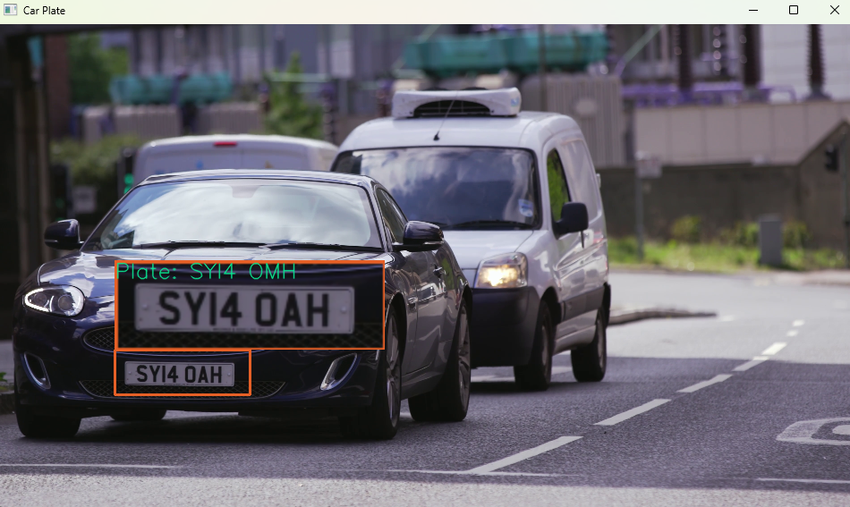

# 🚗🔍 Wykrywanie i rozpoznawanie tablic rejestracyjnych

### 📌 Opis
Projekt wykorzystuje OpenCV oraz EasyOCR do wykrywania i odczytywania tablic rejestracyjnych z materiału wideo. Program analizuje każdą klatkę filmu, wykrywa tablice rejestracyjne oraz wyświetla rozpoznany tekst bezpośrednio na obrazie.

---

# 🚗🔍 License Plate Detection and Recognition

### 📌 Description
This project uses OpenCV and EasyOCR to detect and recognize license plates from video footage. The program analyzes each video frame, detects license plates, and displays the recognized text directly on the image.

---

## ⚙️ Instalacja / Installation

```bash
pip install -r requirements.txt
```

Plik `requirements.txt` powinien zawierać:
```txt
easyocr
opencv-python
numpy
```

---

## 🚀 Uruchomienie / Run the script

```bash
python main.py
```

---

## 🛠 Wymagania / Requirements
- Python 3.x
- OpenCV
- EasyOCR

---

## 📸 Przykłady działania / Example screenshots

### 📷 Screenshot 1


### 📷 Screenshot 2


---

## 📜 Licencja / License
Ten projekt jest udostępniany na licencji MIT.
This project is released under the MIT license.

